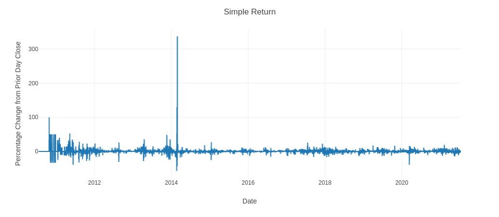
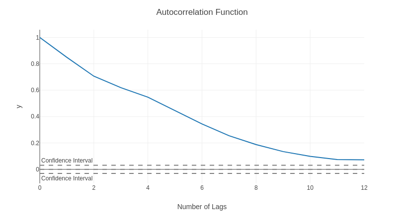
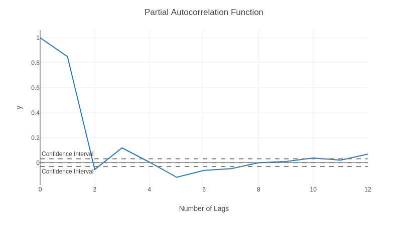
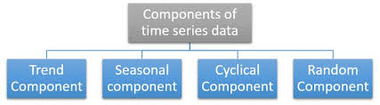

# Bitcoin Price Analysis and Prediction  

  

## Motivation  

It would be an understatement to say that there is a lot of hype surrounding cryptocurrency, especially Bitcoin. Perhaps much of the hype is due to the novelty. Perhaps the hype is due to the practicality of a digital currency. We'll leave the speculation to future historians and focus on analyzing Bitcoin closing price as both a timeseries problem and a machine learning problem.

## Data Origins

The data for this project comes via investpy, a Python package to retrieve data from Investing.com, which provides data retrieval from up stocks, funds, ETFs, currency crosses, indices, bonds, commodities, certificates, and cryptocurrencies.  

It allows the download of both recent and historical data and includes data from countries all over the world. AND (this is key) it seeks to stop relying on public/private APIs which can be deprecated or dicontinued leading to frustration and/or broken applications created around said APIs. This was my case and why I did not use yfinance.  

If you have any curiosity or work in any market related field utilizing Python, I encourage you to visit the link below:  

https://pypi.org/project/investpy/

## Regarding the Data  

The data is contrained in a typical timeseries format as can seen below. My analysis was focused on utilizing the 'Close' price for each date in the timeseries. Any additional columns presented or tranformations performed were on this column only.

| Date                |   Open |   High |   Low |   Close |   Volume | Currency   |
|:--------------------|-------:|-------:|------:|--------:|---------:|:-----------|
| 2010-07-18 00:00:00 |    0   |    0.1 |   0.1 |     0.1 |       75 | USD        |
| 2010-07-19 00:00:00 |    0.1 |    0.1 |   0.1 |     0.1 |      574 | USD        |
| 2010-07-20 00:00:00 |    0.1 |    0.1 |   0.1 |     0.1 |      262 | USD        |
| 2010-07-21 00:00:00 |    0.1 |    0.1 |   0.1 |     0.1 |      575 | USD        |
| 2010-07-22 00:00:00 |    0.1 |    0.1 |   0.1 |     0.1 |     2160 | USD        |

## Analysis     

We can begin our analysis by looking at the historical 'Close' price next to both Simple and Log Returns. This is useful as some types of market data are non-stationary, their means and variances change over time, so working with returns can remedy this situation. 

  

  

  

To emphasize this point, let's take a look at the 'Close' price in Logscale. We can clearly see a trending mean which in timeseries vernacular means the data is non-stationary. In order to build an accurate forecast model from the timeseries data we have to verify sationarity. We can do so by looking at the rolling mean and standard deviation in addition to considering the results of the Dicky Fuller Test.

  

The Dickey–Fuller Test tests the null hypothesis that a unit root is present in an autoregressive time series model. The alternative hypothesis in our utilization of this test is stationarity. We are looking to have a p-value less than 0.05 in order to reject the null hypothesis and consider the data as stationary.  

a) If Test Statistic < Critical Value: --> Reject the Null Hypothesis  
                                        
b) If Test Statistic > Critical Value: --> Fail to reject the Null Hypothesis  

From our Logscaled 'Close' price above we have the following results from the Dickey-Fuller Test:  

|  Results of Dickey-Fuller Test:|                    |
|:-------------------------------|-------------------:|
|  Test Statistic                |         -2.502613  |
|  p-value                       |          0.114840  |
|  Number of Lags Used           |          6.000000  |
|  Number of Observations Used   |       4009.000000  |
|  Critical Value (1%)           |         -3.431982  |
|  Critical Value (5%)           |         -2.862261  |
|  Critical Value (10%)          |         -2.567154  |

In this first case we see that my Test Statistic = -2.502613 is greated than the Critical Value (5%) = -2.862261. Therefore, we fail to reject the Null Hypothesis and have further confirmation that the data is not stationary.  

Let's attempt another transformation of the data to see if we can estalish stationarity. This time we will take our logscaled data above and subtract the moving average which results in perhaps the appearance of seasonal or cyclical

  

|  Results of Dickey-Fuller Test:|                    |
|:-------------------------------|-------------------:|
|  Test Statistic                |     -1.287681e+01  |
|  p-value                       |     -1.287681e+01  |
|  Number of Lags Used           |      1.100000e+01  |
|  Number of Observations Used   |      3.993000e+03  |
|  Critical Value (1%)           |     -3.431989e+00  |
|  Critical Value (5%)           |     -2.862264e+00  |
|  Critical Value (10%)          |     -2.567155e+00  |

In this second case we see that my Test Statistic = -12.87 which is lower than the Critical Value (1%) = -3.43. Therefore we can reject the null hypothesis in favor of the alternative hypothesis, that this particular transformation of the data, is stationary.  

  

Now, let's consider what non-stationary data looks like when utilizing the Autocorrelation Funcion (ACF). If your ACF plot is as flat as Nebraska, your data is non-stationary.

  

Now, consider our transformed data after applying both the Autocorrelation Function (ACF) and the Partial Autocorrelation Function (PACF).  

The ACF describes how well the present value of the series is related with its past values. It can reveal frequency components of a timeseries and by simply changing lag values it can to help determine what seasonality is present within the data.  

The PACF finds the correlation of the residuals (which remain after removing the effects which were already explained by the earlier lag(s)) with the next lag value. Hence ‘partial’ and not ‘complete’ as we remove already found variations before we find the next correlation. If there is any hidden information in the residual which can be modeled by the next lag, we might get a good correlation and we will keep that next lag as a feature while modeling.

  

  

|   Terms   |         ACF        |          PACF      |
|:----------|--------------------|-------------------:|
|    AR     |   Geometric Decay  | p Significant Lags |
|    MA     | q Significant Lags |   Geometric Decay  |
|   ARMA    |   Geometric Decay  |   Geometric Decay  |

## Hurst Exponent:  
## A quick way to investigate if a given time series is trending, mean-reverting or random walking

We can use the Hurst exponent to measure the amount by which a time series deviates from a random walk. The scalar represents the relative tendency of a time series either to regress strongly to the mean (mean-reverting pattern) or to cluster in a certain direction (trending pattern).   

The values of the Hurst exponent range between 0 and 1. Based on the value of H, we can classify any time series into one of the three categories:

* H < 0.5: A mean-reverting (anti-persistent) series. The closer the value is to 0, the stronger the mean-reversion process is. In practice, it means that a high     value is followed by a low value and vice-versa.
* H = 0.5: A geometric random walk.
* H > 0.5: A trending (persistent) series. The closer the value is to 1, the stronger the trend. In practice, it means that a high value is followed by a higher one.  

Below are the Hurst exponent's for our transformed dataset at various lags. The exponents trend toward zero are indicative that our transformed data exhibit mean-reverting behavior:  

|  Hurst Exponent  |          |
|:-----------------|---------:|
|  7 lags          |  0.3607  |
|  12 lags         |  0.3585  |
|  20 lags         |  0.2626  |
|  100 lags        |  0.0883  |
|  300 lags        |  0.0314  |
|  500 lags        |  0.0120  |
|  1000 lags       |  0.0065  |

<!--  -->

### Pipeline  

### Models  

## Conclusion  

## Next Steps  

